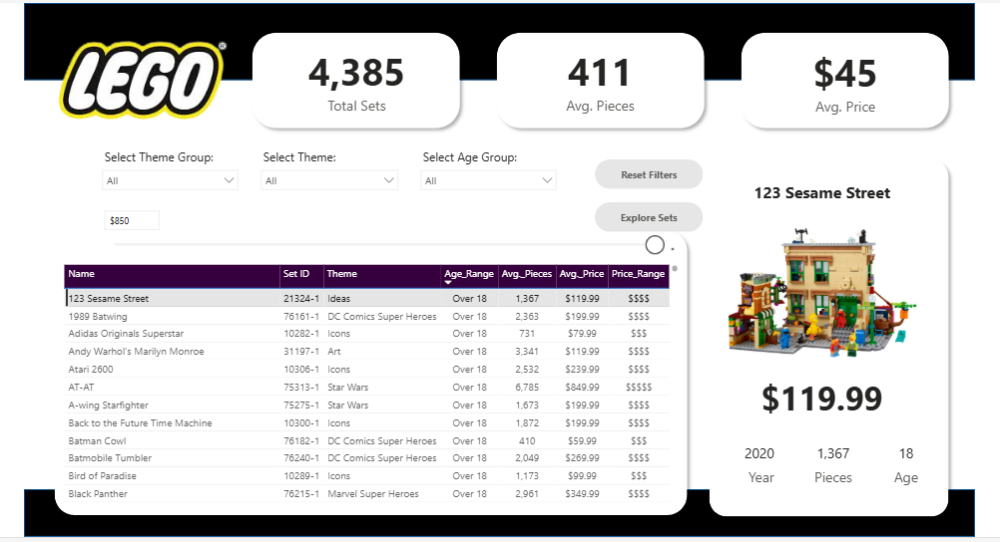
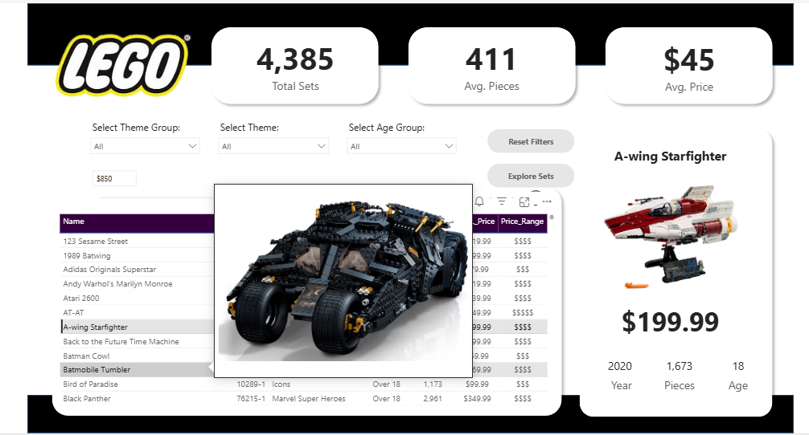
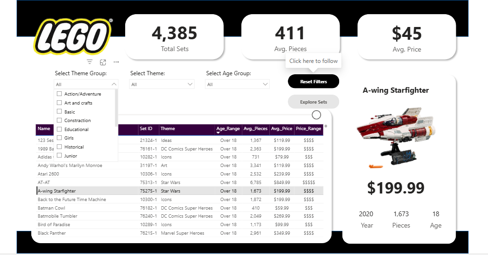
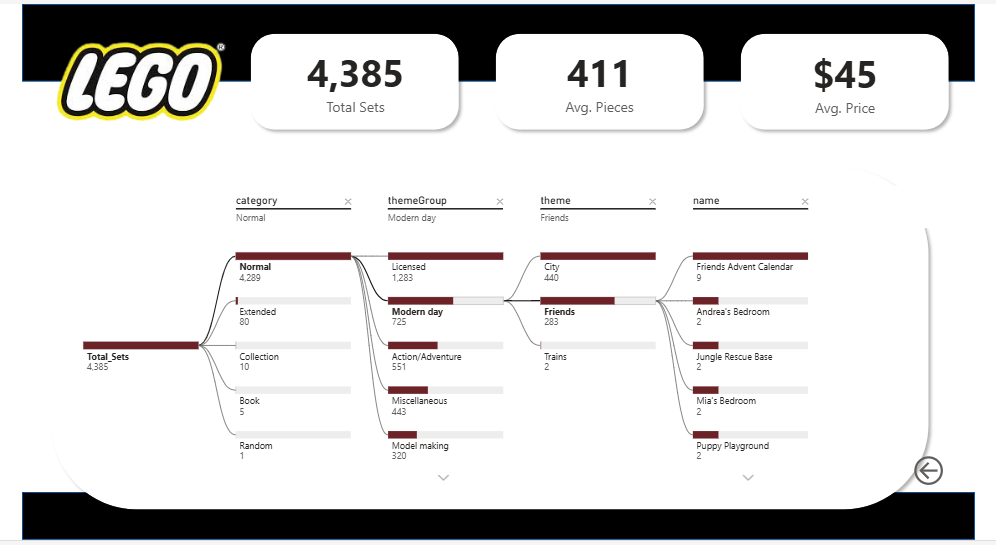

<div align="center">


<br/><br/>

# 🧱 LEGO Set Explorer

### *An interactive Power BI dashboard to help you find the perfect LEGO set — backed by SQL analysis*

<br/>

[📊 Dashboard](#-the-dashboard) · [🔍 SQL Analysis](#-sql-analysis) · [📁 Project Structure](#-project-structure)

---

</div>

## 📌 Overview

**4,385 sets. Dozens of themes. One dashboard.**

The goal was simple — take a raw LEGO dataset, clean it properly, extract meaningful insights through SQL, and build a dashboard that actually tells a story. Not just charts for the sake of charts, but something interactive and useful.

The project covers the full pipeline: raw data → cleaning → SQL analysis → Power BI dashboard.

---

## 📊 The Dashboard

Built in Power BI Desktop. Every visual is connected to slicers, so everything responds when you filter.

<br/>

### 🔎 Set Explorer — Find Any Set

The main page. Three KPI cards at the top give you the big picture at a glance — **4,385 total sets**, **411 avg. pieces**, **$45 avg. price**. Below that, an interactive table lets you browse all sets with their theme, age range, piece count, price, and price tier. Click any row and the detail card on the right updates instantly — showing the set image, price, year, piece count, and age rating.



<br/>

### 🖼️ Set Image Tooltip

Hover over any row in the table and a tooltip pops up with the actual LEGO set image. Clean, minimal, and genuinely useful — no hunting for what a set looks like.



<br/>

### 🎛️ Theme Group Filter in Action

The **Theme Group** slicer expands into a proper multi-select dropdown — Action/Adventure, Art and Crafts, Basic, Construction, Educational, Girls, Historical, Junior, and more. Filtering by theme group instantly updates the table and all three KPI cards.



<br/>

### 🌊 Decomposition Tree — Category → Theme Group → Theme → Set

A decomposition tree that breaks down all 4,385 sets across four levels: **Category → Theme Group → Theme → Set Name**. You can follow any path — for example: Normal (4,289 sets) → Modern Day → Friends (283 sets) → and see every individual Friends set listed out. Drill down or back up at will.



---

## 🔍 SQL Analysis

Before any dashboard work, the data was interrogated with SQL. The analysis is split into three areas, each with its own set of queries.

### 📦 General Overview
- Total distinct LEGO sets in the dataset
- Number of sets per theme, ranked
- Average price across all sets — with the `$` sign stripped from the price column before averaging
- Average piece count per set
- The single most expensive set
- The set with the fewest pieces

### 🏷️ Product Analysis
- Which theme has the highest set count
- Which theme group generates the highest average price
- Top 5 sets with the best price-per-piece ratio (most bricks for your money)
- Which sets give the best value — low price, high piece count

### 📈 Trend Analysis
- Number of sets released per year
- Average price trend across years
- Whether newer sets are genuinely more expensive than older ones

### 👶 Customer Segmentation (Age-Based)
- Which age range has the most products targeted at it
- Average price broken down by age group
- Which age group gets the most piece-dense / complex sets

The price column in the source data is stored as text — `"$29.99"` format — so every price query uses `REPLACE(price, "$", "") + 0` to cast it to numeric before any calculation.

---

## 📁 Project Structure

```
LEGO-Set-Explorer/
│
├── 📂 raw_data/
│   ├── lego_sets_data.csv                  ← Original dataset (untouched)
│   └── lego_sets_data_dictionary.csv       ← Column definitions
│
├── 📂 clean_data/
│   └── lego_sets_clean.csv                 ← Cleaned, analysis-ready version
│
├── 📂 insights(SQL data analysis)/
│   ├── Insights_of_the_data.txt            ← All business questions documented
│   └── extract_insights_using_SQL.sql      ← 184-line SQL file, fully commented
│
├── 📂 dashboard/
│   └── Lego_Dashboard.pbix                 ← Power BI file
│
└── 📂 dashboard_images/
    ├── image_1.png                         ← Set explorer page
    ├── image_2.png                         ← Image tooltip
    ├── image_3.png                         ← Theme group filter
    └── image_4.png                         ← Decomposition tree
```

---

## 🧹 Data Cleaning

The raw file needed work before it was usable:

- **Price as text** — every price value came in as `"$29.99"`. Stripped the dollar sign and cast to numeric for all SQL calculations
- **Missing values** — handled nulls across price, pieces, and age range columns
- **Age range formatting** — inconsistent formats standardized for clean grouping in the dashboard
- **Duplicate set IDs** — identified and removed to keep counts accurate

Cleaned output is saved separately in `clean_data/lego_sets_clean.csv` so the original raw data is never touched.

---

## 🛠️ Tools

| Tool | What it was used for |
|---|---|
| **MySQL** | All SQL-based data exploration and insight extraction |
| **Power BI Desktop** | Dashboard design, all visuals, interactivity, and slicers |
| **CSV / Excel** | Data cleaning and preprocessing |
| **GitHub** | Version control |

---

## 🚀 How to Use

**Open the dashboard:**
1. Download `dashboard/Lego_Dashboard.pbix`
2. Open with [Power BI Desktop](https://powerbi.microsoft.com/desktop/) — it's free
3. All data is embedded, no reconnection needed

**Run the SQL queries:**
1. Import `clean_data/lego_sets_clean.csv` into MySQL (or any SQL environment)
2. Name the table `lego_sets_clean`
3. Run `insights(SQL data analysis)/extract_insights_using_SQL.sql`

---

<div align="center">

Made with too much caffeine and a genuine curiosity about how many LEGO sets actually exist.

If this was helpful — a ⭐ means a lot.

</div>
